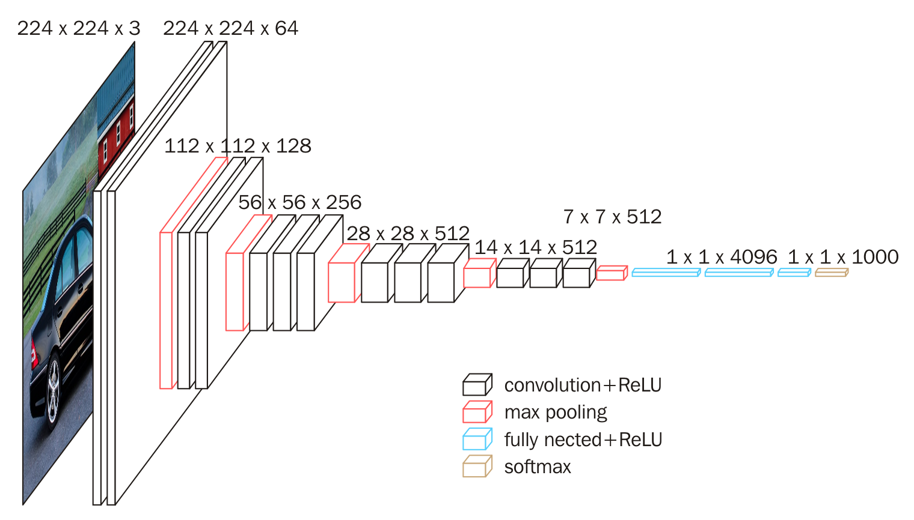

# Deconvolution

提到反卷积，不得不提的是论文《Fully Convolutional Networks for Semantic Segmentation》，这篇论文把传统网络中的全连接部分改成了反卷积。  

首先是以往的图像分割CNN网络都是采用全连接层来最终预测分类的效果，比如VGG16。但是FCN的不同之处是，利用卷积层来取代以往的全连接层，同时利用反卷积，上采样来将最终的heatmap(最终卷积后的高维特征图)还原回大小为原图的分割图像。

### VGG16
- 前5层位卷积，最后三层为全连接层
- 最后输出一个1000维的向量表示输入图像属于每一类的概率

### FCN
- 将最后三层的全连接层改为卷积层，那么FCN可适应任意尺寸的输入。
- 对图像进行像素级分类(语义图像分割)，FCN从抽象特征中恢复出每个像素所属的类别，即将原本的图像级别的分类延申至像素级别的分类。

