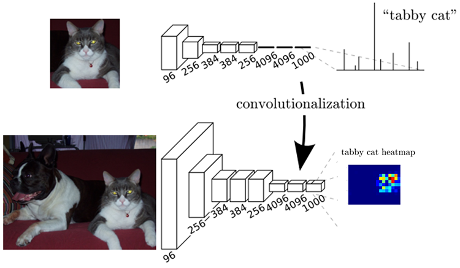
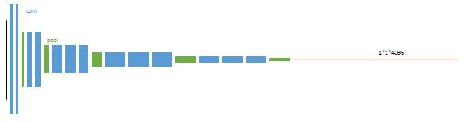

# Deconvolution

提到反卷积，不得不提的是论文《Fully Convolutional Networks for Semantic Segmentation》，这篇论文把传统网络中的全连接部分改成了反卷积。  

首先是以往的图像分割CNN网络都是采用全连接层来最终预测分类的效果，比如VGG16。但是FCN的不同之处是，利用卷积层来取代以往的全连接层，同时利用反卷积，上采样来将最终的heatmap(最终卷积后的高维特征图)还原回大小为原图的分割图像。

*注: heatmap指最后一层卷积的输出，而其他卷积的输出称为featuremap*

### VGG16
- 前5层位卷积，最后三层为全连接层
- 最后输出一个1000维的向量表示输入图像属于每一类的概率

;

### FCN
- 将最后三层的全连接层改为卷积层，那么FCN可适应任意尺寸的输入。
- 对图像进行像素级分类(语义图像分割)，FCN从抽象特征中恢复出每个像素所属的类别，即将原本的图像级别的分类延申至像素级别的分类。

### FCN 网络结构图
- 包含上半部分的Convolution以及下半部分的DeConvolution，输入尺寸与输出尺寸相同，但是输出的深度为类别数。
- 此图示例为PASCAL数据集上的示例，因此需要预测的目标有*21类=20类+背景*。
- 蓝色：卷积；绿色：maxPooling

**如何将全连接层变为卷积层**：
> 比如AlexNet卷积后的图像尺寸为7*7*512，然后AlexNet使用了两个4096的全连接层，最后有一个1000的全连接层用于计算分类概率。
> 我们可以将之后的3层全连接层变为卷积层，首先是7*7*512的数据，我们可以用尺寸为F=7的滤波器，那么输出就为[1*1*4096]了。
> 同理，第二个全连接，另滤波器尺寸为F=1，这样输出就为[1*1*4096]
> 第三个全连接，卷积滤波器的尺寸为F=1，最终输出为[1*1*1000]

#### 逐像素预测
- 就如上图所示的，利用[1*1]的卷积得到深度为21的分类结果。*相当于全连接层，对每个像素的4096维特征预测21类的结果*。

#### 反卷积-升采样
- 先进行上采样，即扩大像素，然后进行卷积。
- 反卷积层，橙色，具体参数可以通过训练确定。
- 反卷积和full卷积的原理类似，可以使得图像变大。

**注：反卷积的卷积核设计非常重要，可能会导致棋盘状网格，因此通常反卷积的stride为偶数，参考https://distill.pub/2016/deconv-checkerboard/. **

#### Skip跳级结构
- 因为较浅的结果更为精细，而较深的网络更为鲁棒，那么我们可以把多种层数的网络进行融合，最后裁剪成和输入相同尺寸的输出。

### 训练
#### 1.第一阶段
- 以经典的分类网络为初始化。最后两级是全连接（红色），参数弃去不用。

#### 2.第二阶段
- 从特征小图（16*16*4096）预测分割小图（16*16*21），之后直接升采样为大图。 
- 反卷积（橙色）的步长为32，这个网络称为FCN-32s。 
- 这一阶段使用单GPU训练约需3天。

#### 3.第三阶段
- 升采样分为两次完成（橙色×2）。 
- 在第二次升采样前，把第4个pooling层（绿色）的预测结果（蓝色）融合进来。使用跳级结构提升精确性。 
- 第二次反卷积步长为16，这个网络称为FCN-16s。 
- 这一阶段使用单GPU训练约需1天。

#### 4.第四阶段
- 升采样分为三次完成（橙色×3）。 
- 进一步融合了第3个pooling层的预测结果。 
- 第三次反卷积步长为8，记为FCN-8s。 
- 这一阶段使用单GPU训练约需1天。

#### 5.比较输出
- 较浅层的预测结果包含了更多细节信息。比较2,3,4阶段可以看出，跳级结构利用浅层信息辅助逐步升采样，有更精细的结果。

